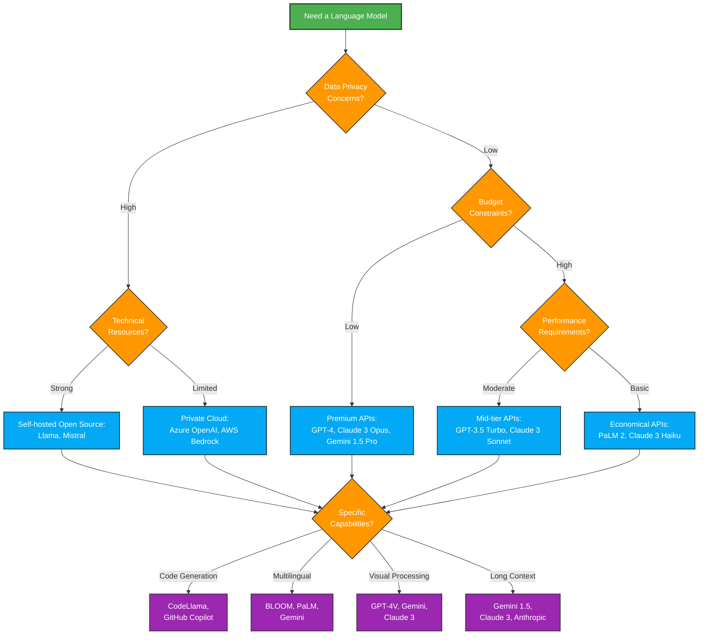

# LLM Model Landscape

The Large Language Model (LLM) landscape is rapidly evolving, with new models and providers emerging regularly. This guide provides an overview of current models, their capabilities, and how they're made available through various services.

## Leading Model Families

### OpenAI Models

| Model | Release Date | Parameters | Key Capabilities | Use Cases |
|-------|-------------|-----------|-----------------|-----------|
| **GPT-4o** | May 2024 | ~1.8T (estimated) | Multimodal, reduced latency, improved reasoning | General purpose AI assistant, code generation, creative content |
| **GPT-4** | March 2023 | ~1.8T (estimated) | Advanced reasoning, multimodal capabilities (vision) | Complex problem solving, creative content generation |
| **GPT-3.5 Turbo** | March 2023 | 175B | Good performance/cost balance | Chatbots, content generation, summarization |
| **DALL-E 3** | Oct 2023 | Not disclosed | Text-to-image generation | Visual content creation, design concepts |

OpenAI models are primarily accessible through:
- OpenAI API
- Microsoft Azure OpenAI Service
- ChatGPT (consumer application)

### Anthropic Models

| Model | Release Date | Parameters | Key Capabilities | Use Cases |
|-------|-------------|-----------|-----------------|-----------|
| **Claude 3 Opus** | March 2024 | Not disclosed | Strongest reasoning, best at complex tasks | Academic research, complex reasoning |
| **Claude 3 Sonnet** | March 2024 | Not disclosed | Balance of intelligence, speed, cost | Business applications, content creation |
| **Claude 3 Haiku** | March 2024 | Not disclosed | Fastest, most compact model | Quick responses, high volume applications |
| **Claude 2** | July 2023 | Not disclosed | Strong reasoning, low hallucination | Customer support, content moderation |

Anthropic models are accessible through:
- Anthropic API
- Amazon Bedrock
- Google Cloud Vertex AI
- Claude (consumer application)

### Google Models

| Model | Release Date | Parameters | Key Capabilities | Use Cases |
|-------|-------------|-----------|-----------------|-----------|
| **Gemini 1.5 Pro** | Feb 2024 | Not disclosed | 1M token context window, multimodal | Document analysis, video understanding |
| **Gemini 1.5 Flash** | Feb 2024 | Not disclosed | Fastest Google model | Real-time applications, chat |
| **Gemini 1.0 Ultra** | Dec 2023 | Not disclosed | Strong reasoning capabilities | Complex problem solving |
| **Gemini 1.0 Pro** | Dec 2023 | Not disclosed | Balanced performance | Business applications, content generation |
| **PaLM 2** | May 2023 | Not disclosed | Multilingual capabilities | Translation, global applications |

Google models are accessible through:
- Google Cloud Vertex AI
- Gemini API
- Google AI Studio
- Bard/Gemini (consumer applications)

### Meta Models

| Model | Release Date | Parameters | Key Capabilities | Use Cases |
|-------|-------------|-----------|-----------------|-----------|
| **Llama 3** | April 2024 | 8B, 70B | Open weights, efficient deployment | On-device AI, custom applications |
| **Llama 2** | July 2023 | 7B, 13B, 70B | Open weights, commercial use permitted | Self-hosted solutions, edge computing |
| **Code Llama** | Aug 2023 | 7B, 13B, 34B | Code generation, analysis | Developer tools, code completion |

Meta models are accessible through:
- Direct download (weights)
- Various cloud providers
- Hugging Face

## Open Source Models

| Model Family | Key Models | Parameters | Notable Features | Maintainer |
|-------------|-----------|------------|-----------------|------------|
| **Mistral AI** | Mistral 7B, Mixtral 8x7B, Mistral Large | 7B-32B+ | Mixture of Experts, strong performance | Mistral AI |
| **Falcon** | Falcon 7B, 40B, 180B | 7B-180B | Efficient training, Arabic support | Technology Innovation Institute |
| **MPT** | MPT-7B, MPT-30B | 7B-30B | Long context window | MosaicML |
| **BLOOM** | BLOOM, BLOOMZ | 176B | 46 languages and 13 programming languages | BigScience |
| **Pythia** | Pythia 70M-12B | 70M-12B | Research-focused, many checkpoints | EleutherAI |
| **Orca** | Orca 2 | 7B, 13B | Optimized for reasoning | Microsoft |

Open source models are accessible through:
- Direct download (weights)
- Hugging Face
- GitHub
- Self-hosted deployments

## Cloud Provider Offerings

### Amazon Web Services (AWS)

**Amazon Bedrock** provides managed API access to:
- Amazon Titan (Amazon's own models)
- Anthropic Claude models
- Meta Llama 2 and Llama 3 models
- Mistral AI models
- Cohere models
- AI21 Labs Jurassic models

Key features:
- Knowledge bases for RAG
- Agents for task automation
- Model evaluation tools
- Fine-tuning capabilities
- Guardrails for responsible AI

### Microsoft Azure

**Azure OpenAI Service** provides:
- GPT-4 & GPT-3.5 Turbo
- DALL-E models
- Embeddings models
- Content filtering
- Fine-tuning options
- Azure-specific security and compliance

Other Azure AI offerings:
- Azure AI Studio for end-to-end development
- Azure Machine Learning for custom model training
- AI Search (formerly Cognitive Search) for RAG implementations

### Google Cloud

**Vertex AI** offers:
- Gemini models
- PaLM 2 models
- Fine-tuning capabilities
- Model Garden for accessing various models
- Vector Search for RAG implementations
- Custom model training

### Other Cloud Providers

**IBM watsonx.ai**:
- IBM Granite foundation models
- Access to open source models
- Specialized for enterprise use cases

**Oracle AI Infrastructure**:
- Access to various open models
- GPU infrastructure

## Self-Hosting Solutions

### Ollama

An easy-to-use tool for running open-source LLMs locally:
- One-line installation and model setup
- Support for Mac, Windows, Linux
- Model library including Llama, Mistral, Code Llama, and more
- REST API for integration with applications
- Customization options via Modelfiles

```bash
# Example of running a model with Ollama
ollama run llama3
```

### LM Studio

A GUI application for running models locally:
- User-friendly interface
- Model discovery and download
- Chat interface
- Performance optimization
- API server mode

### LocalAI

An open-source REST API for running models:
- Docker-based deployment
- OpenAI API-compatible endpoints
- Support for various model architectures
- Text, image, and audio generation

### vLLM

High-performance model serving:
- PagedAttention for memory efficiency
- Distributed inference
- OpenAI-compatible API
- Supports popular model formats

```python
# Example of using vLLM
from vllm import LLM

llm = LLM(model="meta-llama/Llama-3-8b")
output = llm.generate("Explain artificial intelligence")
```

## Specialized Model Types

### Code-Specific Models

| Model | Creator | Key Features |
|-------|---------|-------------|
| **CodeLlama** | Meta | Fine-tuned on code, supports multiple programming languages |
| **Starcoder** | BigCode | Trained on permissively licensed code |
| **Codex** | OpenAI | Powers GitHub Copilot |
| **DeepSeek Coder** | DeepSeek | Performance focused on code completion |

### Embedding Models

| Model | Creator | Dimensions | Use Cases |
|-------|---------|-----------|-----------|
| **text-embedding-ada-002** | OpenAI | 1536 | Document search, clustering |
| **BERT** | Google | 768 | Contextual embeddings |
| **E5** | Microsoft | Various | Information retrieval |
| **Cohere Embed** | Cohere | Various | Multilingual embeddings |
| **Nomic Embed** | Nomic AI | Various | Long document embeddings |

### Multimodal Models

| Model | Creator | Modalities | Key Features |
|-------|---------|-----------|-------------|
| **GPT-4o/GPT-4V** | OpenAI | Text, images | Visual understanding, image analysis |
| **Gemini** | Google | Text, images, audio, video | Broad multimodality |
| **Claude 3** | Anthropic | Text, images | Visual reasoning |
| **CLIP** | OpenAI | Text-image | Image-text alignment |
| **LLaVA** | Open source | Text, images | Open multimodal capabilities |

## Model Selection Criteria

When choosing a model for your application, consider:

1. **Performance Requirements**:
   - Task complexity
   - Quality expectations
   - Necessary capabilities (reasoning, creative generation, etc.)

2. **Operational Constraints**:
   - Cost considerations
   - Latency requirements
   - Privacy and data security needs

3. **Integration Factors**:
   - API compatibility
   - Context window needs
   - Deployment environment

4. **Responsible AI Concerns**:
   - Content filtering capabilities
   - Bias mitigation
   - Transparency and explainability

## Cost Comparison

| Provider/Model | Input Cost (per 1M tokens) | Output Cost (per 1M tokens) | Notes |
|----------------|----------------------------|----------------------------|-------|
| OpenAI GPT-4o | $5 | $15 | Balance of performance and cost |
| OpenAI GPT-3.5 Turbo | $0.50 | $1.50 | Cost-effective for many tasks |
| Anthropic Claude 3 Opus | $15 | $75 | Premium performance |
| Anthropic Claude 3 Sonnet | $3 | $15 | Mid-tier offering |
| Anthropic Claude 3 Haiku | $0.25 | $1.25 | Most affordable Claude model |
| Google Gemini 1.5 Pro | $7 | $21 | Long context capabilities |
| AWS Bedrock Titan | $0.80 | $1.20 | AWS native option |
| Self-hosted open source | Hardware & operational costs | Hardware & operational costs | Upfront investment, lower marginal cost |

*Prices as of May 2024, subject to change*

## Future Trends

The LLM landscape continues to evolve rapidly, with several key trends emerging:

1. **Multimodal Expansion**: Models are increasingly handling multiple types of data beyond text
2. **Specialization**: Domain-specific models optimized for particular industries or tasks
3. **Efficiency Improvements**: Smaller models with competitive performance through improved architecture
4. **Local Deployment**: More capable models running on consumer hardware
5. **Tool Integration**: Models designed to work seamlessly with external tools and APIs
6. **Reasoning Enhancements**: Better logical reasoning, planning, and world modeling capabilities
7. **Open Weights Movement**: Continued momentum in openly available model weights

## Model Selection Decision Tree




## Setup Examples

### OpenAI API Integration

```python
import openai

client = openai.OpenAI(api_key="your_api_key")

response = client.chat.completions.create(
    model="gpt-4o",
    messages=[
        {"role": "system", "content": "You are a helpful assistant."},
        {"role": "user", "content": "Explain how language models work."}
    ]
)

print(response.choices[0].message.content)
```

### AWS Bedrock Integration

```python
import boto3
import json

bedrock = boto3.client('bedrock-runtime')

response = bedrock.invoke_model(
    modelId='anthropic.claude-3-sonnet-20240229-v1:0',
    body=json.dumps({
        "anthropic_version": "bedrock-2023-05-31",
        "max_tokens": 1000,
        "messages": [
            {"role": "user", "content": "Explain how language models work."}
        ]
    })
)

result = json.loads(response['body'].read())
print(result['content'][0]['text'])
```

### Local Deployment with Ollama

```python
import requests
import json

response = requests.post(
    'http://localhost:11434/api/generate',
    json={
        'model': 'llama3',
        'prompt': 'Explain how language models work.',
        'stream': False
    }
)

result = response.json()
print(result['response'])
```

## Conclusion

The model landscape continues to evolve at a rapid pace. When selecting a model or provider for your application, consider the balance between performance, cost, privacy, and ease of integration. Many organizations adopt a hybrid approach, using different models for different use cases based on their specific requirements.