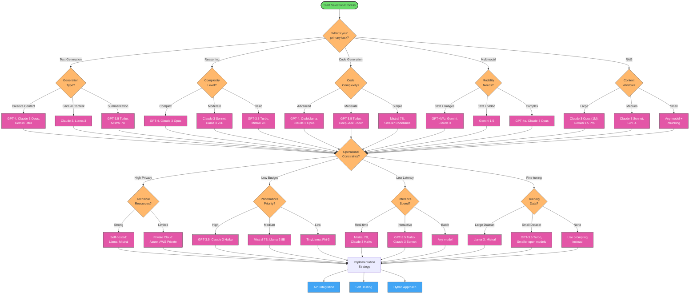

# LLM Model Selection Guide

Selecting the right Large Language Model (LLM) for your specific needs can be challenging given the rapidly expanding landscape of available models. This guide provides a structured approach to help you make informed decisions when choosing an LLM.

## LLM Selection Decision Tree

Below is a visual decision tree to help you navigate the LLM selection process:



## Decision Framework

### 1. Define Your Requirements

Start by clearly defining your requirements across these dimensions:

#### Task Requirements

| Capability | Examples | Considerations |
|------------|----------|----------------|
| **Text Generation** | Content creation, chatbots | Creativity, coherence, tone control |
| **Comprehension** | Summarization, question answering | Accuracy, factuality, context handling |
| **Reasoning** | Problem solving, decision making | Step-by-step thinking, logical consistency |
| **Knowledge** | Domain expertise, factual answers | Up-to-date information, specialized domains |
| **Multimodal** | Image understanding, visual tasks | Visual analysis capabilities |
| **Code Generation** | Programming assistance | Language support, code quality |

#### Operational Constraints

| Constraint | Options | Impact |
|------------|---------|--------|
| **Budget** | Pay-per-token, subscription, self-hosted | Cost per 1M tokens, total usage cost |
| **Latency** | Real-time vs. batch processing | User experience, application performance |
| **Privacy** | Data sensitivity requirements | On-prem vs cloud, data residency |
| **Throughput** | Requests per minute/second | Scaling needs, concurrent users |
| **Context Length** | Document size, conversation history | Model's context window capacity |
| **Fine-tuning** | Customization requirements | Model adaptability, training options |

#### Ethical Considerations

| Consideration | Description | Evaluation Approach |
|---------------|-------------|---------------------|
| **Bias** | Tendency for unfair outputs | Test with diverse inputs, measure demographic performance |
| **Safety** | Harmful content prevention | Evaluate content filtering capabilities |
| **Transparency** | Understanding model decisions | Documentation quality, explainability |
| **Environmental** | Carbon footprint | Model size, inference efficiency |

### 2. Evaluate Model Families

Once you've defined your requirements, you can begin evaluating model families:

#### Commercial API Models

| Model Family | Strengths | Limitations | Best For |
|-------------|-----------|-------------|----------|
| **OpenAI (GPT-4, GPT-3.5)** | State-of-the-art performance, multimodal capabilities, strong reasoning | Higher cost, limited customization | High-quality outputs, complex tasks |
| **Anthropic (Claude)** | Low hallucination, long context window, constitutional approach | Less suited for creative tasks | Content that requires factual accuracy |
| **Google (Gemini)** | Multimodal understanding, knowledge integration | Variable performance across domains | Tasks involving multiple data types |
| **Cohere** | Strong multilingual support, search capabilities | More specialized | Enterprise search, multilingual applications |
| **AI21 (Jurassic)** | Controllable generation | More limited ecosystem | Text generation with specific constraints |

#### Open Source Models

| Model Family | Strengths | Limitations | Best For |
|-------------|-----------|-------------|----------|
| **Meta (Llama)** | Strong open-source performance, commercial use allowed | Requires significant resources | Self-hosted deployments, customization |
| **Mistral AI** | Efficient inference, mixture of experts | Newer ecosystem | Resource-constrained environments |
| **EleutherAI** | Research-focused, transparent | Less optimized for production | Academic research, experimentation |
| **BigScience (BLOOM)** | Multilingual focus | Requires significant resources | Global, multilingual applications |

### 3. Match Models to Use Cases

Different types of applications have specific model requirements:

#### Content Creation

**Ideal models**: GPT-4, Claude 3 Opus, Gemini Ultra, Llama 3
- Look for: Strong creativity, coherence over long outputs, style control
- Example implementations: Blog post generation, marketing copy, creative writing

#### Customer Support

**Ideal models**: Claude 3 Sonnet/Haiku, GPT-3.5 Turbo, Mistral Large
- Look for: Factual accuracy, concise responses, controllable tone
- Example implementations: Support chatbots, ticket classification, response drafting

#### Code Assistant

**Ideal models**: GPT-4o, Claude 3 Opus, CodeLlama, DeepSeek Coder
- Look for: Code understanding, documentation generation, debugging
- Example implementations: IDE plugins, code review tools, documentation generation

#### Enterprise Search/RAG

**Ideal models**: Claude 3, embedding models with dedicated generation models
- Look for: Long context windows, factual grounding, citation capabilities
- Example implementations: Knowledge bases, document Q&A, research assistants

#### Data Analysis

**Ideal models**: GPT-4, Claude 3 Opus, models with tool-using capabilities
- Look for: Structured output, tabular data processing, numerical reasoning
- Example implementations: Data exploration assistants, SQL generation, chart description

## Decision Matrices

### Budget vs. Performance

Use this matrix to align your budget constraints with performance needs:

| Budget Level | Premium Options | Mid-range Options | Economic Options |
|--------------|-----------------|-------------------|------------------|
| **High Priority** | GPT-4, Claude 3 Opus | Mixtral 8x7B (self-hosted) | Fine-tuned smaller models |
| **Balanced** | GPT-4 (limited use) + GPT-3.5 | Claude 3 Sonnet, Llama 3 70B | GPT-3.5 Turbo, Mistral 7B |
| **Cost-Sensitive** | GPT-4 (rare cases only) | Claude 3 Haiku, Gemini Flash | Llama 2/3, Mistral 7B |

### Privacy vs. Ease of Implementation

Balance privacy requirements against implementation complexity:

| Privacy Needs | Enterprise-Grade | Standard Business | Flexible |
|---------------|------------------|-------------------|----------|
| **Self-hosted Only** | Azure OpenAI (dedicated), AWS Private | Llama 3 70B, Mixtral 8x7B | Mistral 7B, Llama 2 7B |
| **Data Residency** | AWS Bedrock, Azure OpenAI | Regional cloud providers | Fine-tuned smaller models |
| **Standard** | OpenAI, Anthropic, Google | Any major API provider | Any model |

### Latency vs. Quality

Choose between responsiveness and output quality:

| Quality Needs | Real-time (< 500ms) | Interactive (< 3s) | Background Process |
|---------------|---------------------|-------------------|---------------------|
| **Premium** | Distilled models, Claude 3 Haiku | GPT-4o, Claude 3 Sonnet | GPT-4, Claude 3 Opus |
| **Standard** | Llama 3 8B, Mistral 7B | GPT-3.5 Turbo, Llama 3 70B | Claude 3 Sonnet, Mixtral |
| **Basic** | TinyLlama, Phi | Mistral 7B, Llama 2 | Larger open models |

## Implementation Considerations

### API vs. Self-Hosting Trade-offs

| Factor | API Approach | Self-Hosting Approach |
|--------|-------------|----------------------|
| **Initial Cost** | Low (pay-per-use) | High (infrastructure setup) |
| **Ongoing Cost** | Scales with usage | Fixed infrastructure costs |
| **Maintenance** | Provider managed | Team responsibility |
| **Customization** | Limited to API features | Full control |
| **Privacy** | Provider policies apply | Complete data control |
| **Latency** | Network-dependent | Local network only |
| **Scale** | Easy scaling | Requires infrastructure planning |

### Hybrid Approaches

Many successful implementations use multiple models for different purposes:

1. **Model Cascade**: Try smaller/faster models first, fall back to larger models when needed
2. **Task Specialization**: Use different models for different tasks (e.g., embeddings vs. generation)
3. **Cost Optimization**: Premium models for customer-facing content, economic models for internal use

```python
# Example of a model cascade approach
def get_response(query, importance=1):
    """
    Get response using appropriate model based on query importance
    importance: 1 (low) to 5 (high)
    """
    if importance <= 2:
        # Use economic model for simple queries
        return call_model("gpt-3.5-turbo", query)
    elif importance <= 4:
        # Use mid-tier model for moderate complexity
        return call_model("claude-3-sonnet", query)
    else:
        # Use premium model for high-importance queries
        return call_model("gpt-4", query)
```

### Evaluation and Testing

Before finalizing your model selection:

1. **Create a benchmark dataset** relevant to your specific use case
2. **Test multiple models** on this dataset using consistent prompts
3. **Evaluate outputs** based on your key requirements
4. **Measure performance metrics** such as:
   - Response quality (accuracy, coherence, relevance)
   - Response time and latency
   - Cost per request
   - Error rates and edge case handling

```python
# Example evaluation framework
import time
import json

def evaluate_model(model_name, test_cases, metrics=["quality", "latency", "cost"]):
    results = []
    
    for test in test_cases:
        start_time = time.time()
        response = call_model(model_name, test["input"])
        latency = time.time() - start_time
        
        # Calculate cost (example based on token count)
        tokens = count_tokens(test["input"]) + count_tokens(response)
        cost = calculate_cost(model_name, tokens)
        
        # Human or automated evaluation of quality
        quality_score = evaluate_quality(response, test["expected"])
        
        results.append({
            "test_case": test["name"],
            "latency": latency,
            "cost": cost,
            "quality": quality_score,
            "response": response
        })
    
    return results
```

## Practical Model Selection Examples

### Example 1: Customer Service Chatbot

**Requirements:**
- Quick responses (< 2 seconds)
- Consistent, helpful tone
- Ability to understand product-specific terminology
- Moderate budget constraints

**Best options:**
1. **Primary choice**: Claude 3 Sonnet - balanced performance and cost
2. **Budget alternative**: GPT-3.5 Turbo with fine-tuning
3. **Self-hosted option**: Llama 3 70B or Mistral Large

**Implementation strategy:**
- Fine-tune on company documentation and support conversations
- Implement RAG for product knowledge
- Use structured output for consistent formatting

### Example 2: Code Generation Tool

**Requirements:**
- High-quality code output
- Support for multiple programming languages
- Security and privacy compliance
- Integration with existing developer tools

**Best options:**
1. **Primary choice**: GPT-4 or Claude 3 Opus for highest quality
2. **Alternative**: CodeLlama 70B for self-hosted deployment
3. **Budget option**: A combination of DeepSeek Coder and custom retrievals

**Implementation strategy:**
- Use specialized code-focused models
- Implement syntax validation and testing
- Consider a hybrid approach with specialized and general models

### Example 3: Enterprise Document Analysis

**Requirements:**
- Long document processing
- High factual accuracy
- Data privacy compliance
- Customization for industry terminology

**Best options:**
1. **Primary choice**: Claude 3 Opus (1M token context window)
2. **Alternative**: Gemini 1.5 Pro for multimodal documents
3. **Self-hosted**: Mistral Large with document chunking

**Implementation strategy:**
- Implement robust RAG system for factual grounding
- Use document chunking for models with smaller context windows
- Fine-tune on industry-specific terminology

## Future-Proofing Your Selection

The LLM landscape evolves rapidly. To future-proof your model selection:

1. **Build abstraction layers** in your architecture to swap models easily
2. **Monitor performance metrics** to identify when a model change might be beneficial
3. **Stay informed about new models** and capabilities
4. **Regularly re-evaluate your selection** against new options (every 3-6 months)
5. **Consider multi-model architectures** that can incorporate new models

```python
# Example of a model abstraction layer
class LLMProvider:
    def __init__(self, default_model="gpt-3.5-turbo"):
        self.default_model = default_model
        self.models = {
            "gpt-4": OpenAIModelAdapter("gpt-4"),
            "gpt-3.5-turbo": OpenAIModelAdapter("gpt-3.5-turbo"),
            "claude-3-opus": AnthropicModelAdapter("claude-3-opus"),
            "mistral-large": MistralModelAdapter("mistral-large"),
            # Easy to add new models here
        }
    
    def generate(self, prompt, model=None, **kwargs):
        """Generate text using specified model or default"""
        model_name = model or self.default_model
        if model_name not in self.models:
            raise ValueError(f"Model {model_name} not supported")
        
        return self.models[model_name].generate(prompt, **kwargs)
    
    # Add a new model adapter at runtime
    def add_model(self, name, adapter):
        self.models[name] = adapter
```

## Conclusion

Selecting the right LLM is a complex decision that depends on many factors. By systematically evaluating your requirements against the capabilities, limitations, and costs of available models, you can make an informed choice that best serves your specific use case.

Remember that the LLM landscape continues to evolve rapidly. The best practice is to implement flexible architectures that allow you to adapt as new models emerge and existing ones improve.